# BakeLog

Nothing Design fırın yonetim paneli. Tek kullanicili, SQLite tabanli, 3 rollerli PIN auth. Satis, gider, uretim, fire, musteri borcu takibi ve local sorgu motoru.

TR / EN / DE dil destegi.

## Ozelikler

- **Dashboard** — Gunluk/haftalik/aylik net satis, gider, fire, uretim ozeti
- **Satis** — Ekle, listele, sil (son 1000 kayit)
- **Gider** — Dinamik kategori ekleme, gunluk/haftalik/aylik gider gosterimi
- **Uretim** — Urun bazinda uretim girisi, adet/kg
- **Fire** — Fire kaydi, gunluk/haftalik/aylik oran
- **Musteri Borcu** — Cari takip, odeme kaydi, bakiye
- **Urun & Kategori CRUD** — Tam ekle/sil/guncelle
- **Sorgu Motoru (3+1 Model)** — 3 zaman butonu (Bugun/Hafta/Ay) + 7 hizli metrik + 10 hazir SQL sorgu
- **HTMX** — Sayfa yenilemeden gecis, anlik sorgu sonuclari
- **3 Rollu PIN Auth** — Kasiyer / Usta / Patron, rol bazli sayfa kisitlama
- **Nothing Design** — Monokrom, Space Grotesk + Space Mono, light/dark tema
- **Coklu Dil** — TR (varsayilan), EN, DE — JSON i18n, header dropdown

## Ekran Goruntuleri

| | | |
|---|---|---|
| 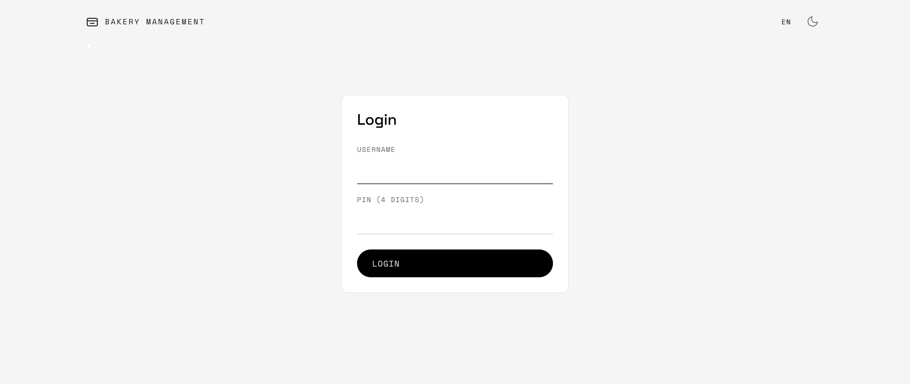 | 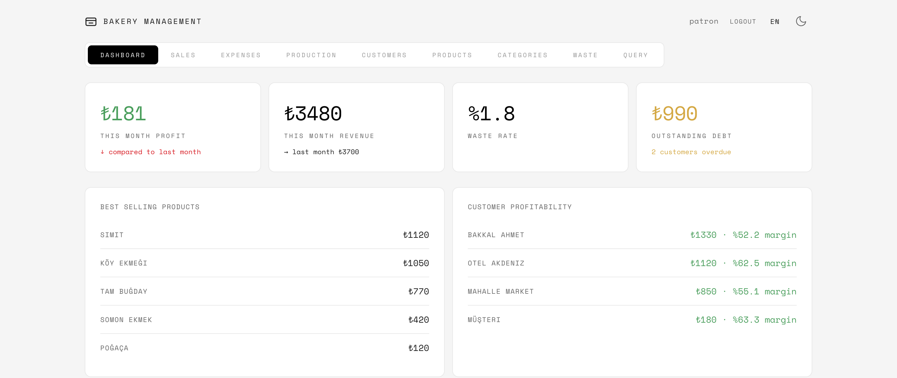 | 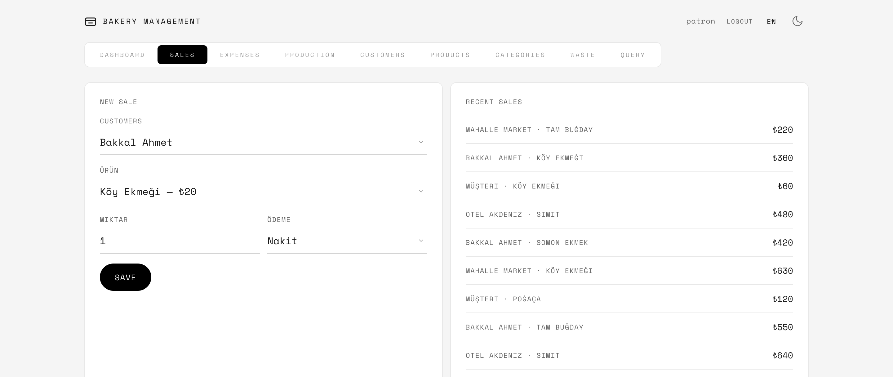 |
| 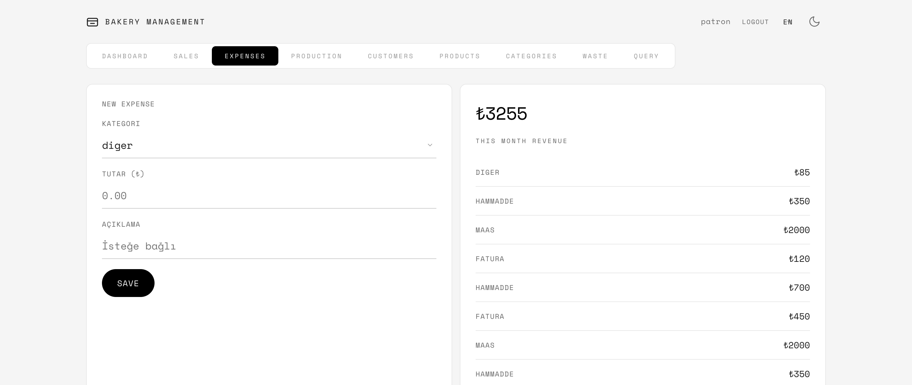 | 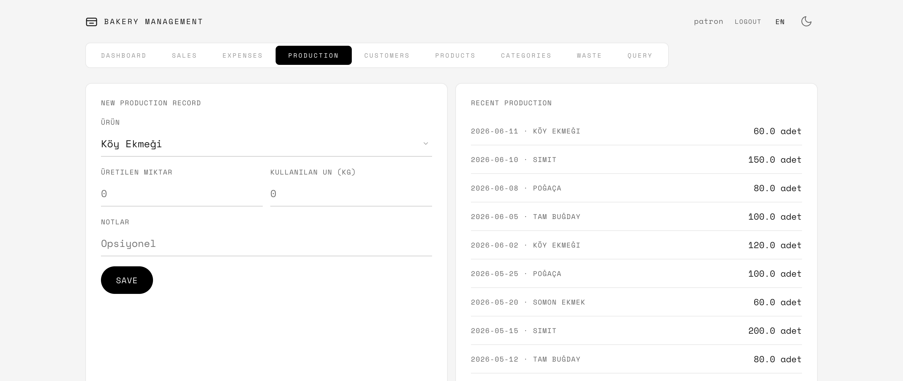 | 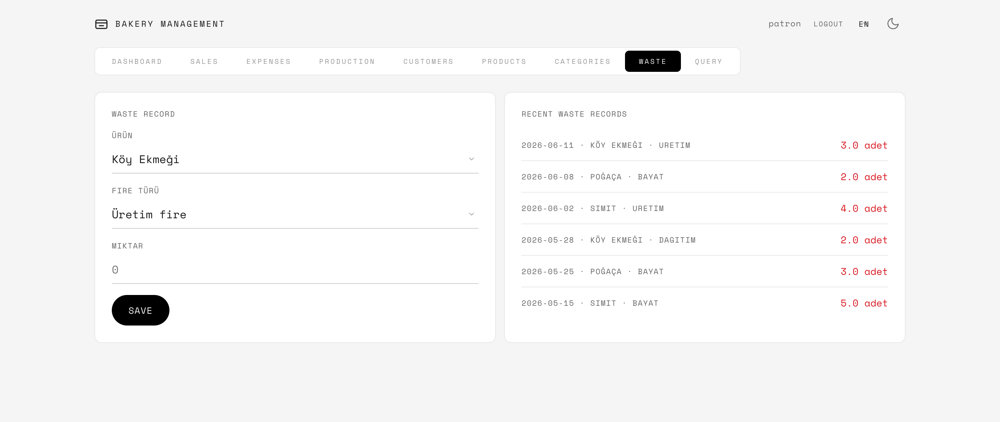 |
| 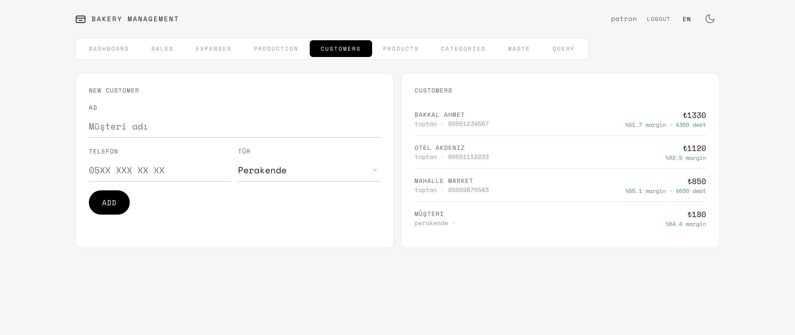 | 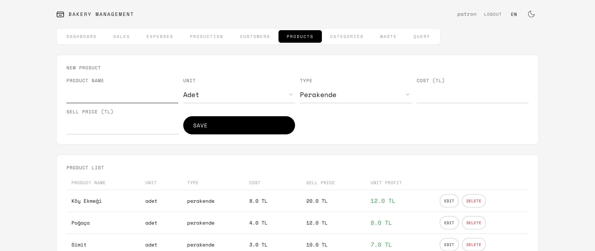 | 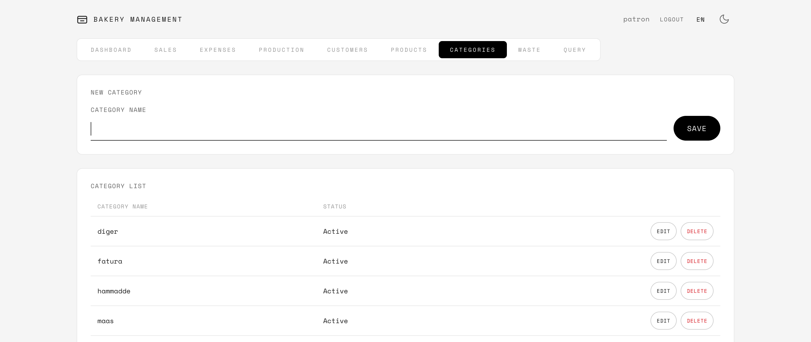 |
| 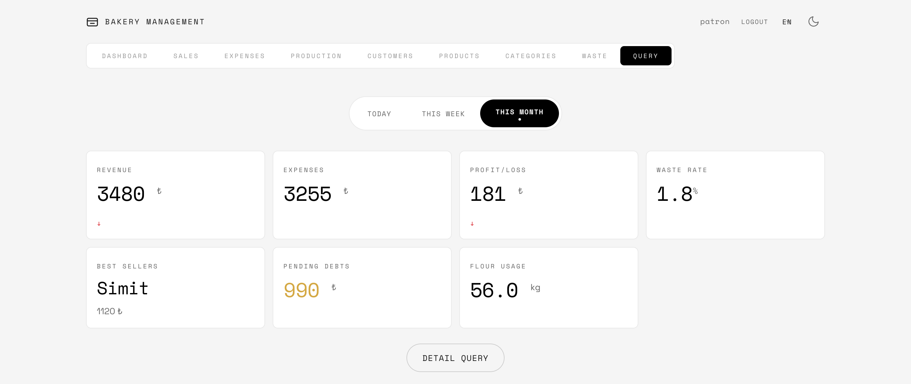 | 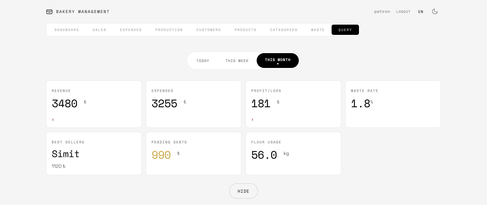 | |

## Kurulum

### Gereksinimler

- Python 3.9 veya uzeri (yoksa [python.org](https://www.python.org/downloads/) adresinden indirin)
- Git (yoksa [git-scm.com](https://git-scm.com/downloads) adresinden indirin)

### Adim Adim

**1. Repoyu bilgisayariniza indirin**

Terminal (macOS) veya Komut Istemi'nde (Windows) su komutu calistirin:

```bash
git clone https://github.com/ceyhanmolla/BakeLog.git
cd BakeLog
```

**2. Sanal ortam olusturun (opsiyonel ama onerilir)**

```bash
python3 -m venv .venv
```

#### macOS / Linux

```bash
source .venv/bin/activate
```

#### Windows

```bash
.venv\Scripts\activate
```

Aktif oldugunda terminalde `(.venv)` yazisi gorunur.

**3. Bagimliliklari yukleyin**

```bash
pip install -r requirements.txt
```

**4. Ortam degiskenlerini ayarlayin**

```bash
cp .env.example .env
```

**.env** dosyasini bir metin editoruyle acip `SECRET_KEY` degerini degistirebilirsiniz. Varsayilan haliyle de calisir.

**5. Uygulamayi baslatin**

```bash
python3 app.py
```

**6. Tarayicinizda acin**

```
http://localhost:5001
```

### Giris Yapma

Seed kullanicilar (tumunun PIN'i `0000`):

| Rol | Kullanici Adi | PIN |
|-----|---------------|-----|
| Patron | `patron` | `0000` |
| Kasiyer | `kasiyer` | `0000` |
| Usta | `usta` | `0000` |

**Not:** Ilk calistirmada `veritabani.db` otomatik olusur ve ornek verilerle dolar. Dilerseniz `models.py` icindeki `seed_data()` fonksiyonunu duzenleyerek kendi verilerinizle baslayabilirsiniz.

## Roller

| Sayfa | Patron | Kasiyer | Usta |
|-------|--------|---------|------|
| Dashboard | + | + | + |
| Satis | + | + | - |
| Gider | + | - | + |
| Uretim | + | - | + |
| Fire | + | - | + |
| Musteri Borcu | + | + | - |
| Urunler | + | - | - |
| Kategoriler | + | - | - |
| Sorgu | + | - | - |

## Teknoloji

- Python 3 / Flask
- SQLite (WAL mode)
- HTMX 2.x
- Nothing Design CSS (ozel)
- JSON i18n

## Lisans

GNU General Public License v3.0. Bakiniz [LICENSE](LICENSE).
